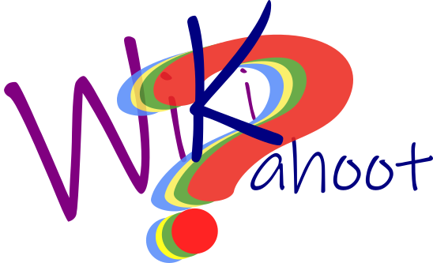

<div id="top"></div>
[![LinkedIn][linkedin-shield]][linkedin-url]


<!-- PROJECT LOGO -->
<br />
<div align="center">
  <a href="https://github.com/github_username/repo_name">
    
  </a>

<h3 align="center">WikiKahoot</h3>

  <p align="center">
    Selecciona y descarga preguntas y respuestas del juego Kahoot. Fíltralas por nombre, etapa o nivel de dificultad y descárgalas en formato XLSX para importarlas directamente en tus juegos Kahoot.
  </p>
</div>


<!-- TABLE OF CONTENTS -->
<details>
  <summary>Table of Contents</summary>
  <ol>
    <li>
      <a href="#about-the-project">About The Project</a>
      <ul>
        <li><a href="#built-with">Built With</a></li>
      </ul>
    </li>
  </ol>
</details>


<!-- ABOUT THE PROJECT -->
## About The Project

[![Captura de pantalla- Home][product-screenshot]]()

    Selecciona y descarga preguntas y respuestas del juego Kahoot. Fíltralas por nombre, etapa o nivel de dificultad y descárgalas en formato XLSX para importarlas directamente en       tus juegos Kahoot.

<p align="right">(<a href="#top">back to top</a>)</p>


### Built With

* [Next.js](https://nextjs.org/)
* [React.js](https://reactjs.org/)
* [Vue.js](https://vuejs.org/)
* [Angular](https://angular.io/)
* [Svelte](https://svelte.dev/)
* [Laravel](https://laravel.com)
* [Bootstrap](https://getbootstrap.com)
* [JQuery](https://jquery.com)

<p align="right">(<a href="#top">back to top</a>)</p>


### Installation
1. Clone the repo
   ```sh
   git clone https://github.com/jorgepexp/WikiKahoot.git
   ```
2. Install NPM packages
   ```sh
   npm install
   ```
3. Run the project
 ```sh
 npm run serve
 ```


<p align="right">(<a href="#top">back to top</a>)</p>


<!-- USAGE EXAMPLES -->
## Usage

Use this space to show useful examples of how a project can be used. Additional screenshots, code examples and demos work well in this space. You may also link to more resources.

_For more examples, please refer to the [Documentation](https://example.com)_

<p align="right">(<a href="#top">back to top</a>)</p>


<!-- CONTACT -->
## Contact

Jorge Pérez Expósito - jorge.pexp@gmail.com

Project Link: [https://github.com/joregepexp/WikiKahoot](https://github.com/joregepexp/WikiKahoot)


<!-- ACKNOWLEDGMENTS -->
## Acknowledgments

* [Json-as-xlsx](https://www.npmjs.com/package/json-as-xlsx)
* [Axios](https://github.com/axios/axios)

<p align="right">(<a href="#top">back to top</a>)</p>


<!-- MARKDOWN LINKS & IMAGES -->
<!-- https://www.markdownguide.org/basic-syntax/#reference-style-links -->
[linkedin-shield]: https://img.shields.io/badge/-LinkedIn-black.svg?style=for-the-badge&logo=linkedin&colorB=555
[linkedin-url]: https://linkedin.com/in/jorge-perez-exposito
[producuct-screenshot]: src/assets/imagen.png
